# COMP541 Vivado Installation Guide

## System Requirements

In order to install the required software for this class, you will need one of the following:

* A computer running Windows with at least 80 GiB of free disk space, or an external storage device with at least 80 GiB free
* A computer running Linux with at least 80 GiB of free disk space, or an external storage device with at least 80 GiB free
* A computer running macOS with virtualization software running a Windows or Linux virtual machine with at least 80 GiB of storage space available to it (either on disk or with an external storage device)

Please note that in practice you may not need the full 80 GiB. Typically, students use between 60 and 80 GiB during the semester.

## 1. Windows
Running Windows natively makes this process relatively straightforward.

### Step 1: Download Vivado

Go to this URL: https://www.xilinx.com/support/download.html

Download the Xilinx Unified Installer 2021.x: Windows Self Extracting Web Installer (EXE).

### Step 2: Install Vivado

Open the installer. Select _Vivado HL WebPACK_.

On the next screen, under Devices, the only box that needs to be checked is _Artix-7_ (under _7 series_). To save disk space, you may uncheck SoCs and UltraScale since we do not need them. On the following screens, use the default options. If you would like to change hte location of the installed software, **be sure there are no spaces in the path name**. Under _Installation Options_, be sure _Install Cable Drivers_ option is checked. Click _Install_.

_Note:_ A free license is included with _Vivado HL WebPACK_. While it has some project size limitations, it is more than adequate for our purposes.

## 2. Linux

This guide was written assuming you are using Ubuntu, or another similar Debian based distro. If you are using something else, you are probably used to things not working right away, so we encourage you to Read The Manual (and come to Office Hours!).

### Step 1: Download Vivado

Go to this URL: https://www.xilinx.com/support/download.html 

### Step 2: Install Vivado

There are a lot of configuration options for this part.

## 3. macOS
As a Mac user, things are a little more ~~frustrating~~ interesting. First of all, you will need some sort of virtualization software. We have found both VirtualBox and Parallels to work. In this guide, we will be creating a Windows 10 Virtual Machine with VirtualBox. The Windows ISO file (Step 4) may take a while depending on your connection, so you can go ahead and start downloading it while you’re following steps 1–3.

### Step 1: Download VirtualBox

From this url: https://www.virtualbox.org/wiki/Downloads 

Select “OS X Hosts”

### Step 2: Install VirtualBox

Open the file you just downloaded, and double click on `VirtualBox.pkg`

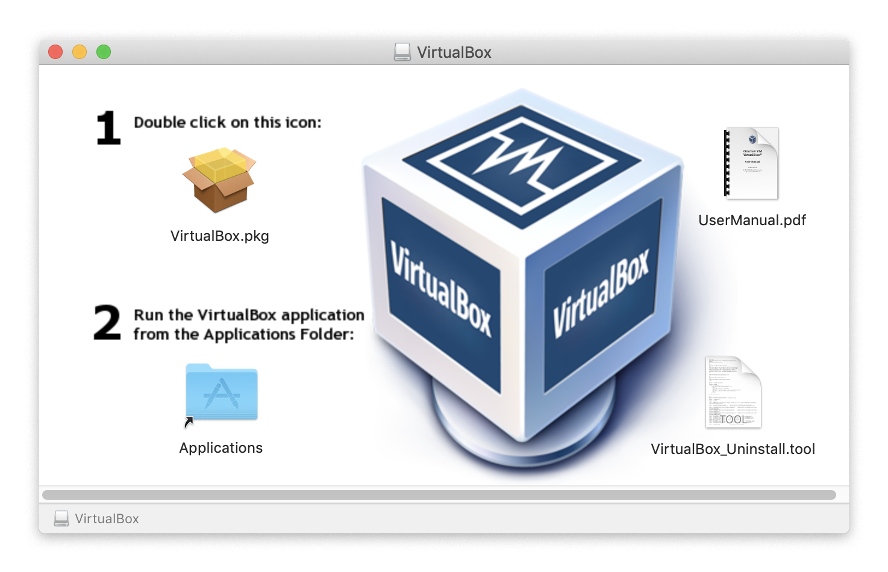

Follow install instructions for VirtualBox.

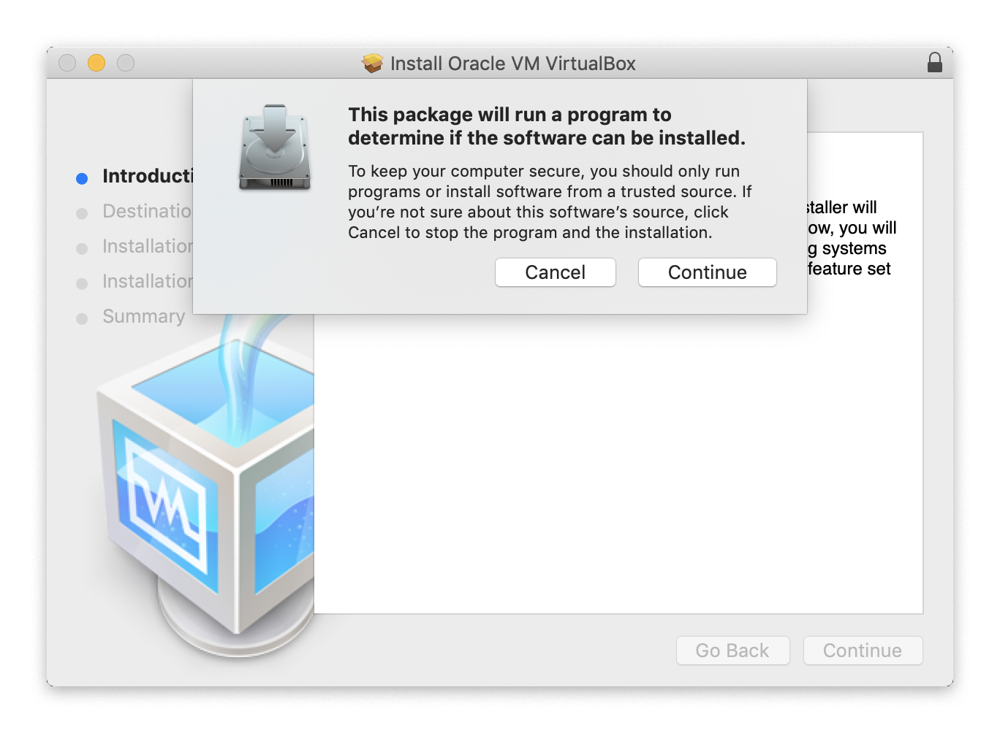

You may have to type in your password.

It is safe to move the installer to the trash after the install is complete.

### Step 3: Create new VM
Click “New” (the blue starburst).

Name the new machine something clear. You can’t go wrong with “Win10”

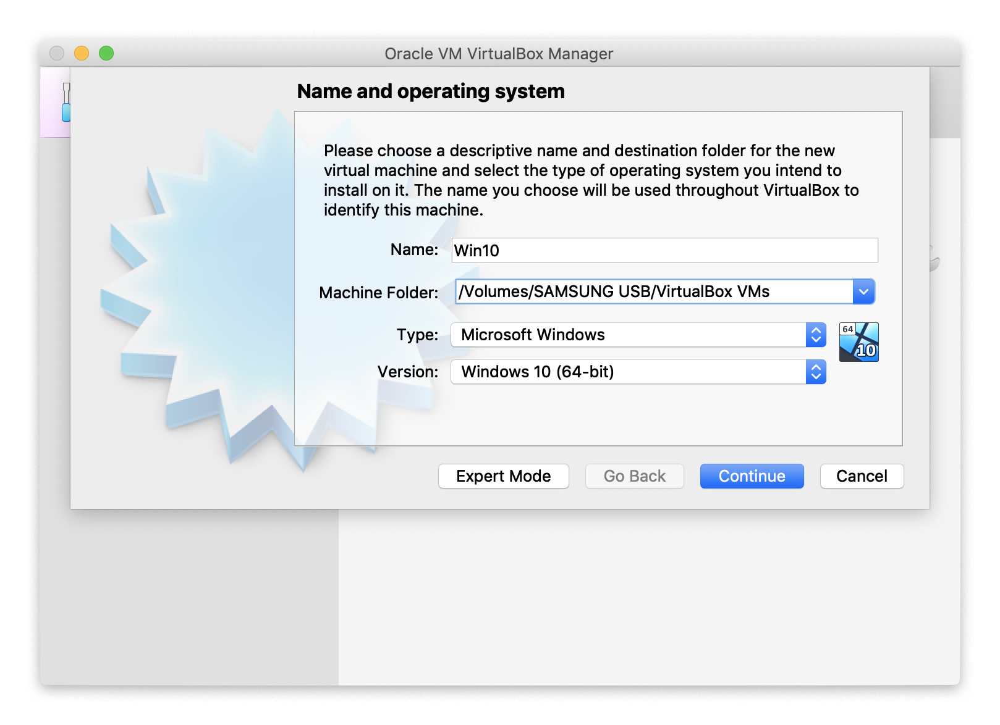

Set the memory size to 4096MB, or half of your computer’s memory, whichever is more.

Select “Create a virtual hard disk now” and then “Create”

Ensure “VDI” is selected, and then click “Continue”

Ensure “Dynamically allocated” is selected, and then click “Continue”

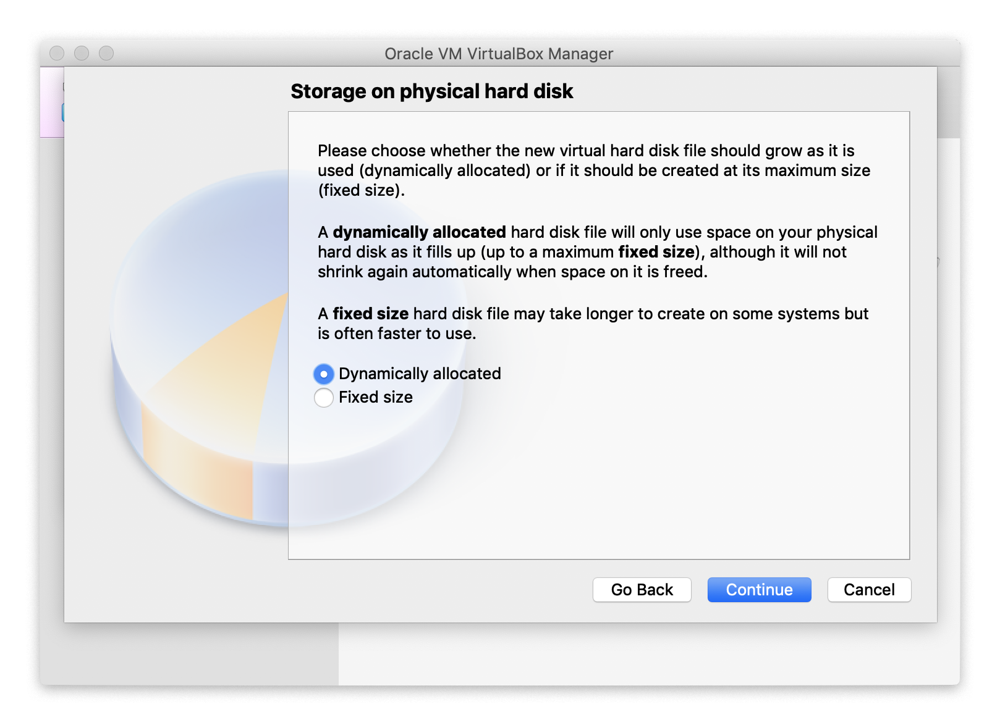

Set the memory to at least 80GB, but we recommend 100GB. Then click “Create.”

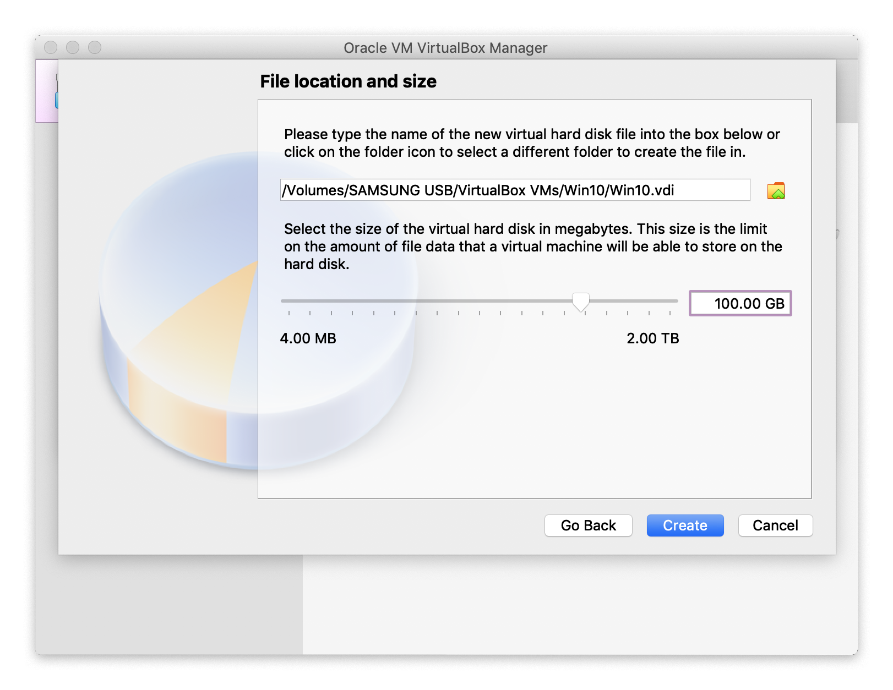

Your VirtualBox window should roughly resemble this one.

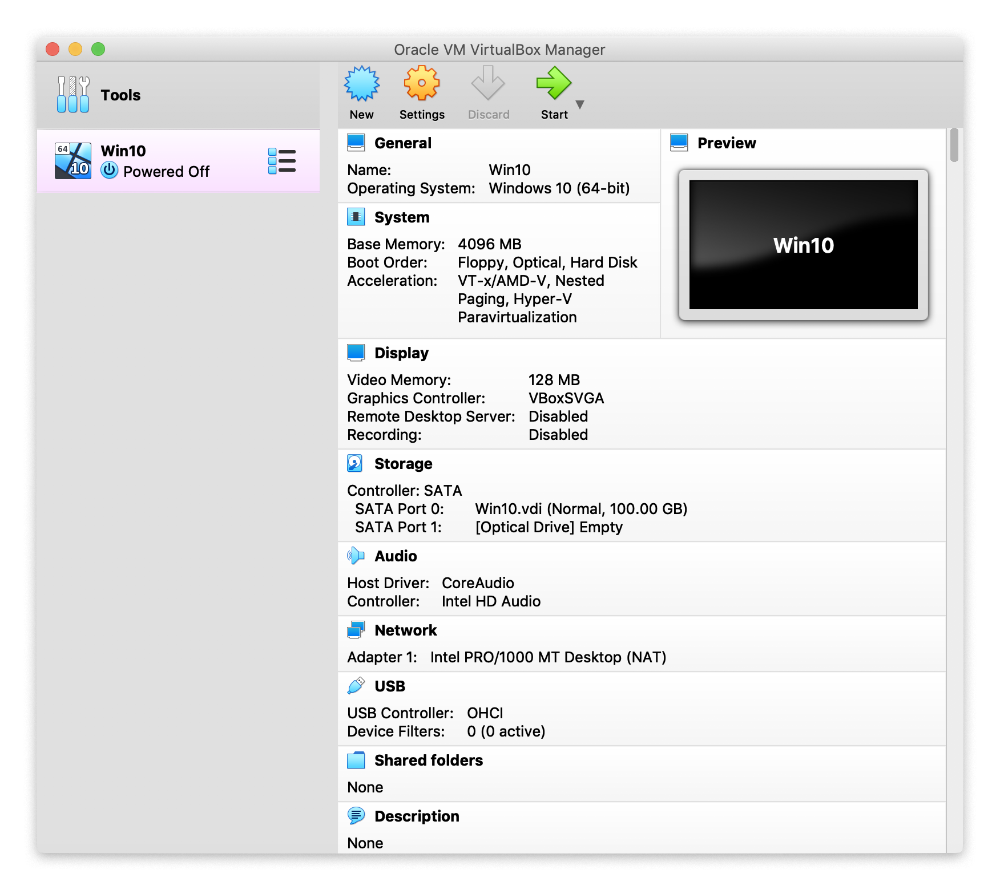

### Step 4: Download Windows ISO file

Go to this URL and download the Windows 10 ISO: https://www.microsoft.com/en-us/software-download/windows10ISO 

Make sure to get the 64-bit version.

### Step 5: Install Windows on VM

Back in VirtualBox, click “Settings,” then “Storage.”

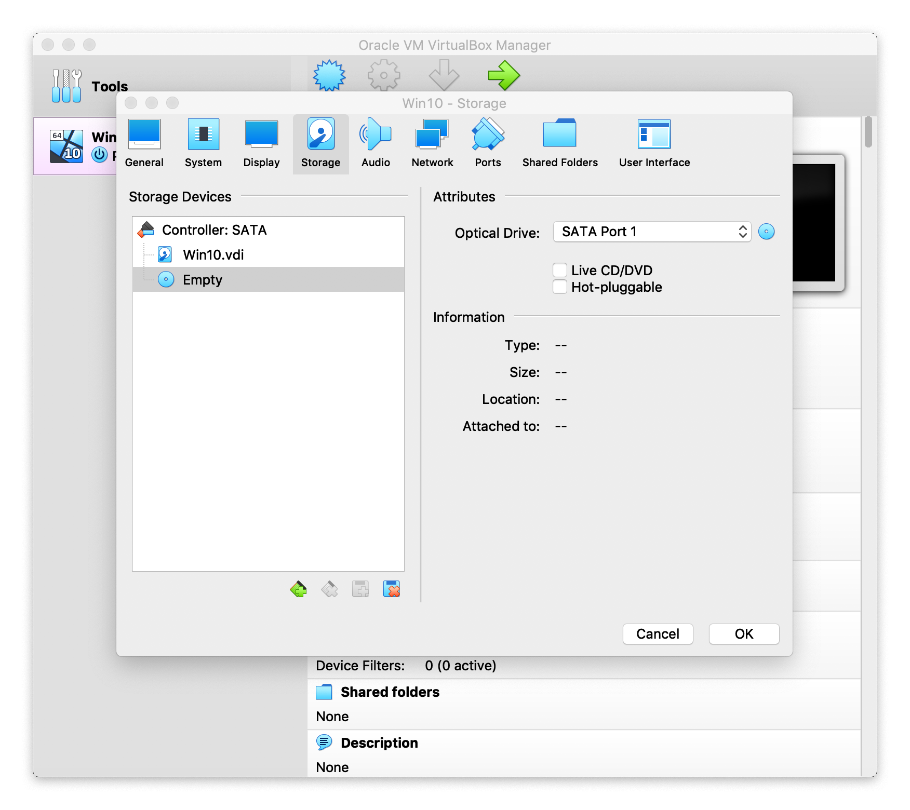

Click the small blue disk icon in the upper right, then select “Choose Disk File…,” select the Windows 10 ISO file you downloaded in Step 4, and then click OK.

Now, start the VM by clicking “Start.” If VirtualBox asks about controlling your computer using accessibility features, allow them. Make sure the Windows ISO file is selected (although it should be by default).

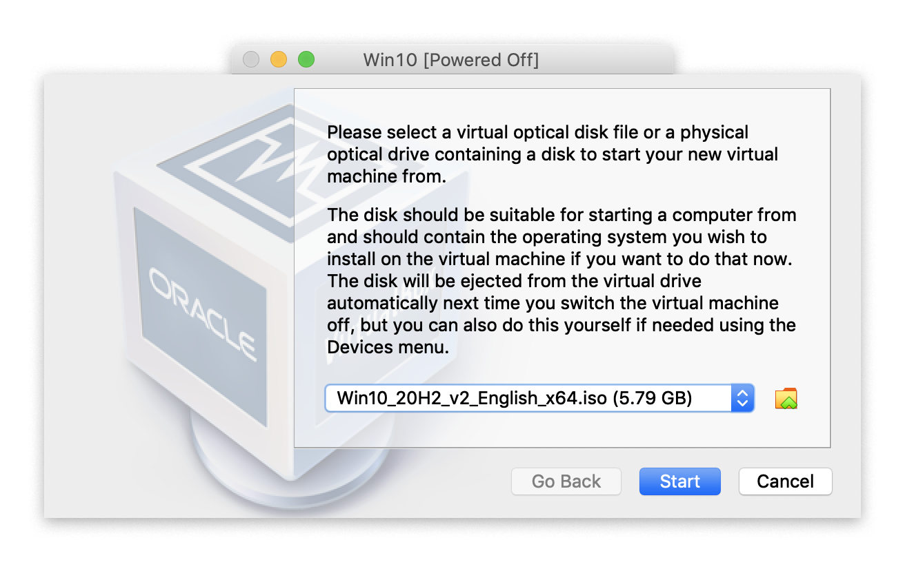

Use the appropriate language and keyboard settings and click Install.

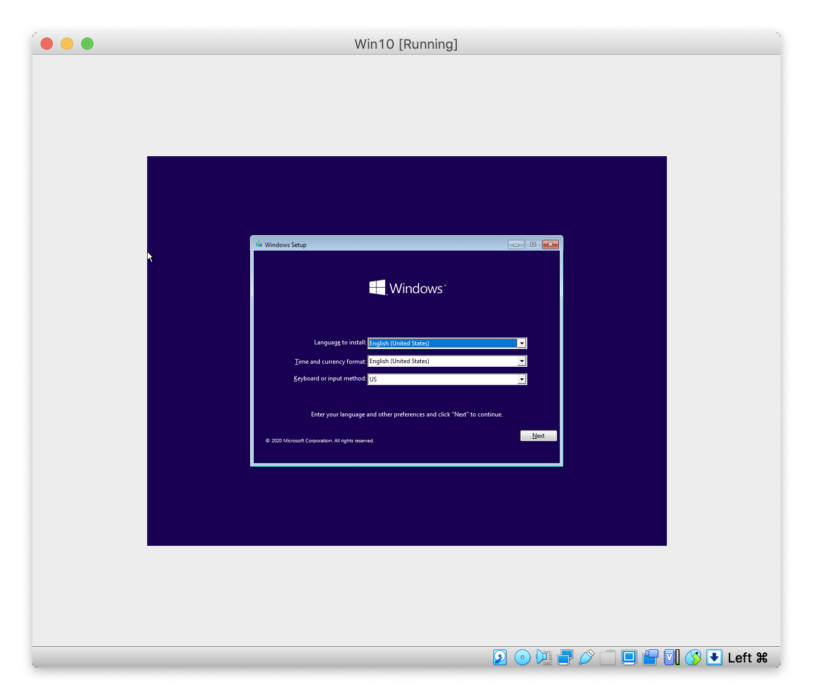

You can safely ignore the product key alert for the entire class. It is not necessary to have a licensed version of Windows for COMP541.

_Optional:_ to make the Windows screen readable on HiDPI displays, click View > Virtual Screen 1 > Scale to 200%

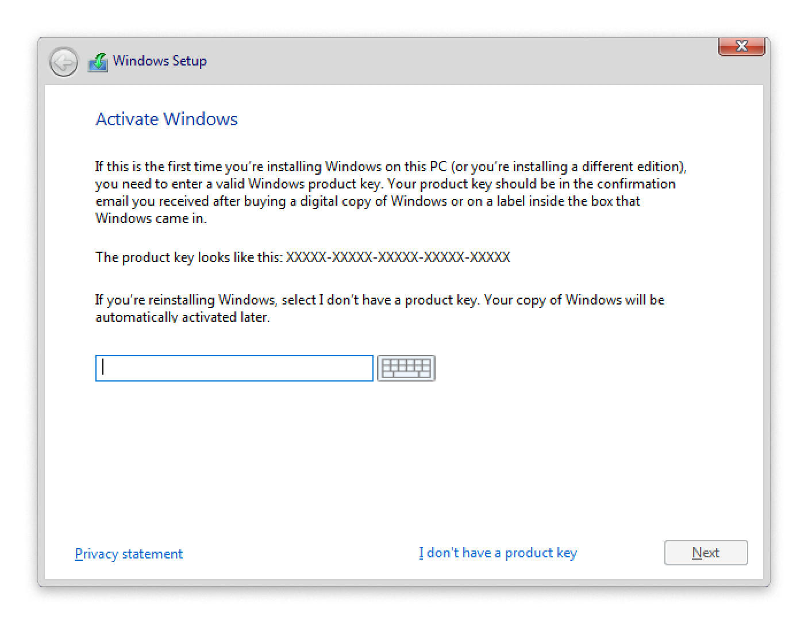

Select Windows 10 Education. Accept the Terms of Service. Select Custom Install (you are installing a fresh copy of Windows, not upgrading one). There will only be one drive available upon which to install Windows, select it (it will likely be called “Drive 0”). Now, wait for the install. It usually takes around a half an hour.

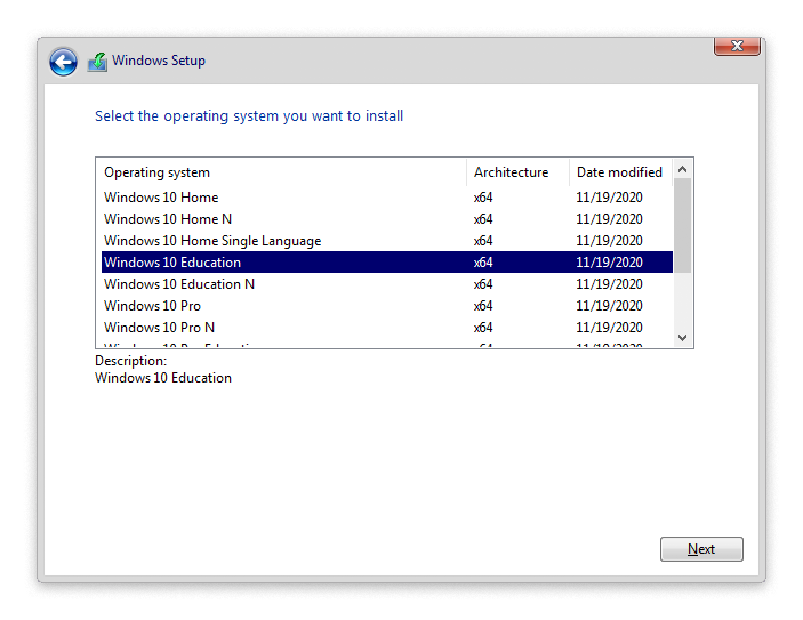

After that, follow standard install instructions. Set the region, keyboard layout, and log in to Microsoft.

_Optional:_ if you don’t want to log in to Microsoft, you can get around the nearly-mandatory login screen by disabling the internet connection temporarily. You can either just turn off wifi or unplug ethernet, or select Devices > Network and uncheck “Connect Network Adapter.” Then, click “Domain Join,” and when Windows cannot connect to the internet, it will revert to standard account creation procedure. Enter your name, password, and security questions. For privacy settings, enter whatever you like, but know that none of the options are required for COMP541, so feel free to disable all of them.

### Step 6: Install VirtualBox Guest Additions

Click Devices > Insert Guest Additions CD image...

It should appear in your VM as though you had actually inserted a CD (often under “This PC”). Double click on “VBoxWindowsAdditions-amd64” and allow the app to make changes.

### Step 7: Download Vivado

Now, in the virtual machine, follow the **1. Windows** instructions above.
